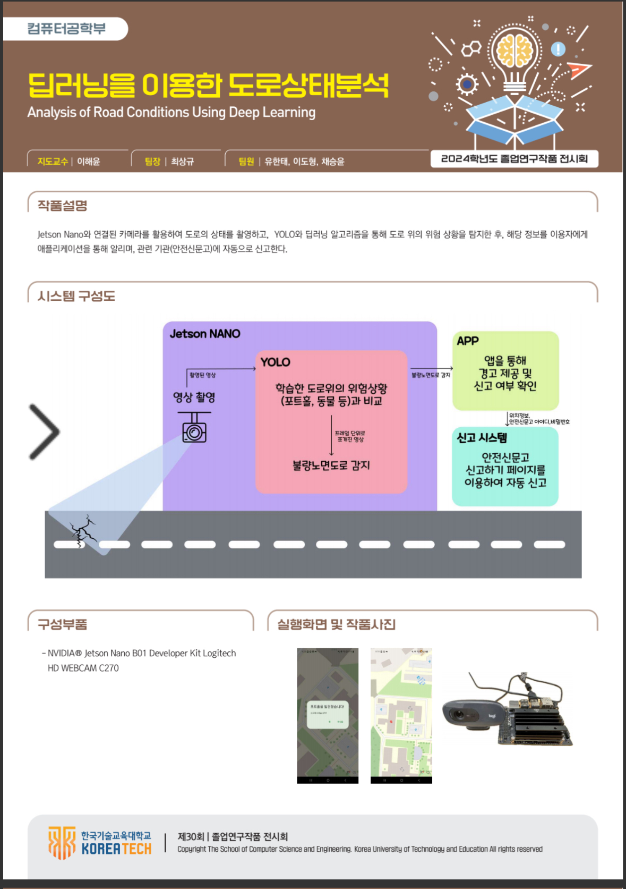
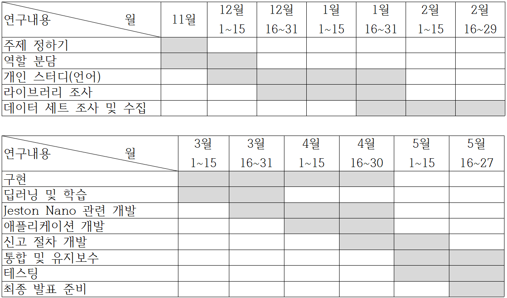
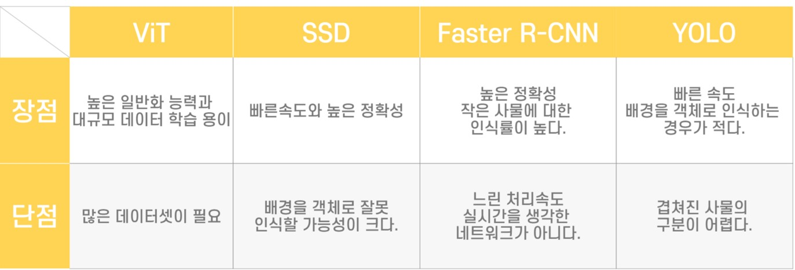
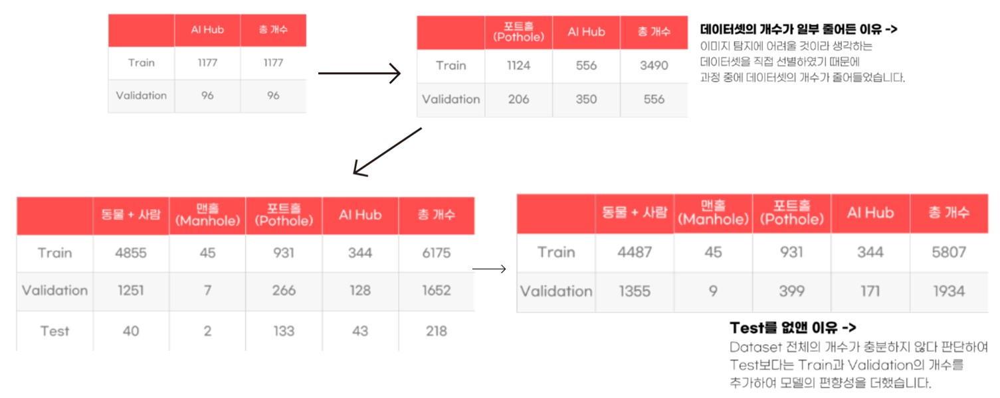
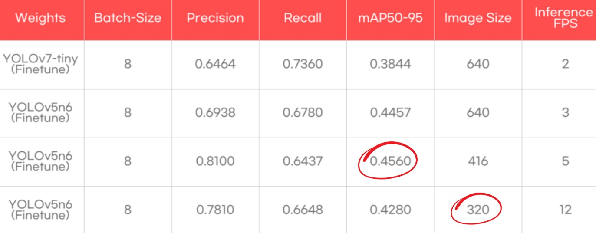
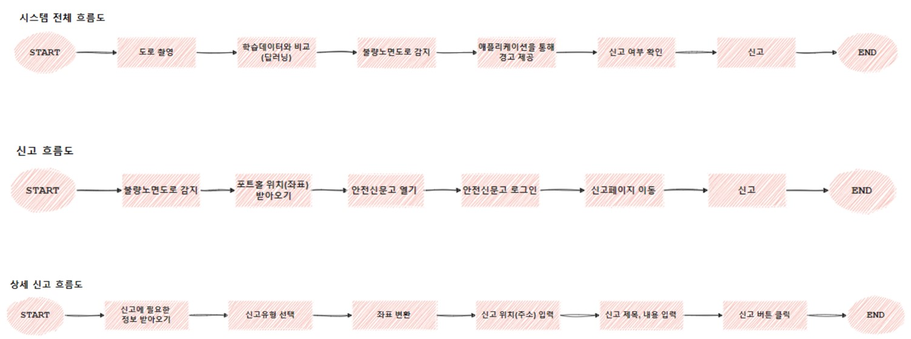

# 딥러닝을 이용한 도로 상태 분석 시스템

---
## 👥 참여 인원
- 최상규 : 팀장, Dataset 분류 및 신고 시스템 개발
- 유한태 : Dataset 수집 및 라벨링, Jetson Nano 성능 개선
- 이도형 : Dataset 수집 및 라벨링, 딥러닝 모델 학습
- 채승윤 : Dataset 분류, Application 개발 및 서버 구현

---
## 🎯설계 목적
운전 중 도로 위 위험 상황 (포트홀, 도로 위 사람/동물 등..)에 대해, 
운전자가 이에 대해 신속하게 대응하고 신고할 수 있도록 
딥러닝을 이용한 도로 상태 분석 시스템을 개발하였습니다. 
운전자의 사고 예방 및 불량한 도로 개선을 목표로 합니다.

---
## 📆개발 차트
23.11 ~ 24.06

---
## ⚒️개발 환경
### Languages

### Others

---
## 🧱 딥러닝/AI 부분

### 딥러닝 모델 선정 (YOLO) 이유

  
### Datasets
- 23.12 : Train (1177), Validation (96)
- 24.03 : Train (3490), Validation (556)
- 24.04 : Train (6175), Validation (1652), Test (218)
- 24.05 : Train (5807), Validation (1934)

  
### 딥러닝 지표 (mAP50-95) 선정 및 기준
[mAP50-95](https://docs.ultralytics.com/ko/guides/yolo-performance-metrics/#how-to-calculate-metrics-for-yolov8-model) : 50% ~ 95% 범위의 IoU 임계값에서 계산된 평균 정밀도의 평균

보통 YOLO는 box loss를 사용하는 것이 대표적이지만, 
이 시스템은 검출 횟수보다는 확률이 중요하다 판단하여 
일정 범위의 임계값에 위험 물질이 잡히는 확률을 먼저 고려

---
## 💻 신고 및 동작 (FE/BE) 부분

### 흐름도

  

### 감지 동작 방식
 
[📽️Youtube Video](https://youtu.be/wzvoA-IFcv0?si=WYxMF-M46FqU5OyW)
  

### 주요 기술
- 역지오코딩 : 핸드폰으로부터 받은 좌표를 활용하여 주소로 변환
- 자동화 : 안전신문고로 로그인, 주소 입력, 신고를 Python을 통해 자동화
  

---
## 🛠️ 개발 과정 중 어려웠던 점 및 해결책
### Dataset
도로 파손 관련 **충분한 양의 Dataset**을 구하기 어려웠습니다. 
→ Kaggle 및 AI Hub를 통해 **낮 시간대의 도로 파손 데이터**를 구하였지만, **새벽 및 밤시간대에는 더 많은 Dataset**이 필요합니다.  

### AI
Jetson Nano 기기 이식 시 **과부화 문제**가 발생하였습니다. 
→ **가벼운 딥러닝 모델**을 사용하고 학습 시에도 **파라미터를 조절**하여 가벼운 모델로 만들었습니다.  
**오신고 문제**가 발생하는 경우가 종종 있습니다. 
→ 이를 통해 신고 자동화가 진행될 때 **운전자에게 선택권**을 주었습니다.  

### FE/BE
역지오코딩 시 정확한 좌표값을 알기가 어려웠습니다. 
→ 그럼에도 도로명은 추출할 수 있으므로 신고가 가능했고, 시스템을 더 발전된 기기에 이식하면 신고할 때를 담을 사진 역시 옮길 수 있을 것입니다.  
기기와 핸드폰 통신 시 서버를 거치는 부분이 비효율적입니다. 
→ 비용/시간적 문제로 인해 기기와 핸드폰을 직접 연결하는 케이블을 구하지 못했지만, 시스템이 활용된다면 외부 네트워크가 아니라 내부 네트워크를 사용할 것으로 기대됩니다.  

---
## 💡 느낀점
- 팀 프로젝트를 진행하면서 일정 구성이 중요하다는 것을 깨달았습니다.
- 각자 잘하는 분야에 맞게 배분한 뒤 협업하는 것에 장점을 알게 되었습니다.
- 딥러닝 모델 사용 시 기기에 따라 성능을 Downgrade 시켜야 하는 경우도 있다는 것을 알게 되었습니다.
- 서버를 이용할 때 외부 서버를 사용하는게 아니라 Local을 활용하는 것이 속도/보안 측면에서 이득이 되는 것을 알게 되었습니다.

---
## 추가 자료
[🎞️Presentations](https://docs.google.com/presentation/d/1ySndXvCGiuINXmhP5D2NEmW8uISMpP7e/edit?usp=sharing&ouid=100628032798550805609&rtpof=true&sd=true) 
[📽️Youtube Detect Video](https://youtu.be/wzvoA-IFcv0?si=WYxMF-M46FqU5OyW)

---
## 참고 자료
- 정세열, 카메라와 LiDAR를 이용한 도로노면 환경 분석 시스템, 한양대학교 석사학위논문, 2021 p.11
- 김영민, 김효준, 장준혁, 최시원, 블랙박스를 이용한 실시간 도로 파손 식별 (화이트 박스), 2020 온라인 추계학술발표대회 논문집 제27권 제2호 (2020.11), 한국정보처리학회, 2020, p.1 ~ p.4, p.593 ~ p.594
- 인공지능기반의 도로 파손 정보 제공 기술 개발 최종보고서, 2021, 국토교통기술사업화지원사업 제3차 연도 최종결과 보고서, 국토교통부 국토과학기술진흥원, 2021, p.38 ~ p.39
- [YOLO](https://github.com/ultralytics/yolov5)
- [Jetson Nano](https://www.nvidia.com/ko-kr/autonomous-machines/embedded-systems/jetson-nano/product-development/)
